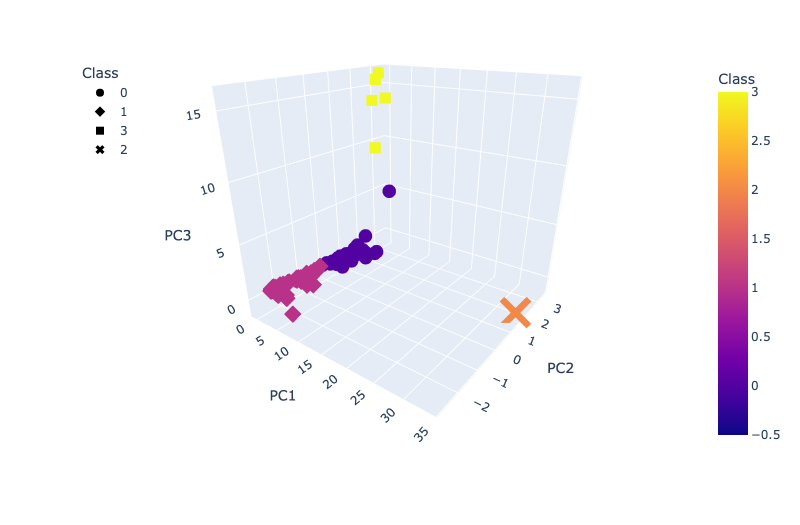
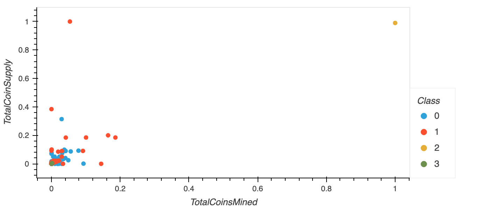
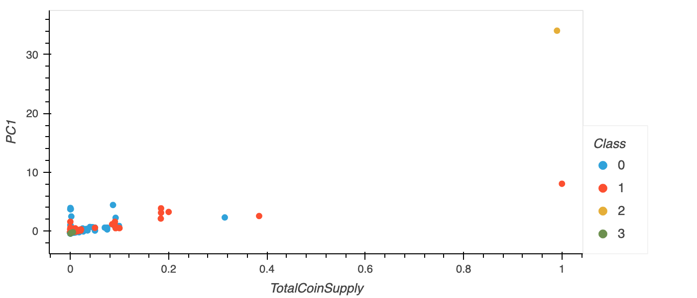

# Cryptocurrencies

## 1. Project Overview

Here, I used principal components analyses and K-Means clustering in Scikit-learn to identify clustering patterns in cryptocurrency data.
Specifically, I analyzed data from [CryptoCompare](https://www.cryptocompare.com/) on currency proof type, algorithm used, total supply, 
and mining history to identify clusters and develop classifications for actively-traded coins that users may employ to guide 
future investment strategies in cryptocurrency. Raw analyses and tables are available in the file ```crypto_clustering.ipynb```, with 
a brief summary provided below.


## 2. Results

After reducing the dimensionality of the data using PCA, I identified four primary clusters differentiating actively-traded cryptocurrencies:


The clusters do not appear to correspond clearly with currency features such as algorithm or proof type. Similarly, there is no apparent
clustering that corresponds with coin supply (either total coins or mined coins):


This is unclear clustering is likely because all principal components explain minimal variance in the data (PC1 = 2.79%, PC2 = 2.14%, PC3 = 2.05%). 
However, PC1 does correlate with the total supply of coins:


## 3. Summary

While this analysis clearly identified four separate clusters in the data, it remains unclear what defines or differentiates these clusters.
While total coins may be the "best" feature in this dataset due to its correspondence with PC1, even its explanatory power is very low. This 
suggests that any number of other variables may be more informative in differentiating categories of cryptocurrencies, and warrant re-analysis
once more features are measured. (Hypothetical examples could include details like the size or demographics of the consumer base for different
currencies, differences in their security, platforms or resources used to support them, etc.) 

Within this dataset itself, some trends may be set by apparent outliers, notably two currencies (TurtleCoin and BitTorrent) with particularly
high total coin supplies. A quick re-analysis with these coins removed might reveal more subtle patterns within the remaining currencies, but
this is unlikely to overcome the deeper issue that more variables are needed to provide meaningful distinctions between categories of
cryptocurrencies.
